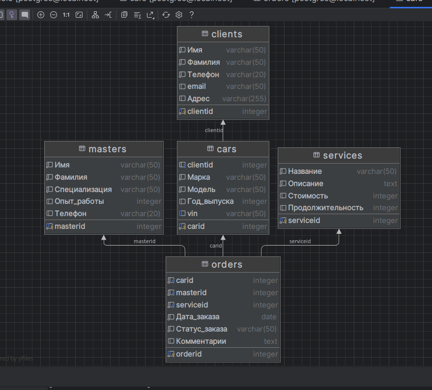

# Лабораторная работа No 1: Создание базы данных и наполнение ее тестовыми данными

## Задание

Самостоятельно выбрать предметную область и разработать логический макет
реляционной базы данных, не менее чем из из 4-х таблиц – не менее трех
«родительских» и одной «дочерней». Родительские таблицы соответствуют
сущностям ER-модели и содержат не менее пяти атрибутов, дочерняя таблица
соответствует связи ER-модели и реализует тернарное отношение типа «многие-
ко-многим». Для каждой из родительских таблиц определить по одному
суррогатному ключу. Дочерняя таблица должна содержать дополнительные
атрибуты, чтобы не превратиться в три внешних ключа.

1. Написать программу (консольное приложение), которая автоматически генерирует относительно правдоподобные тестовые данные для всех четырех таблиц базы данных. Количество записей – не менее 1000 на каждую таблицу.

2. Построить диаграмму базы данных с использованием графического редактора или инструмента моделирования баз данных.

3. Создать три SQL-файла:
   - Сценарий создания базы данных и базовых таблиц.
   - Сценарий определения ограничений.
   - Сценарий массированного копирования данных в базу данных.

4. Выполнить сценарии (запустить сценарии на выполнение) двумя способами:
   - С помощью клиента базы данных.
   - С использованием командной строки.

## Таблица "Клиенты"

- **ClientID (Суррогатный ключ)**
- Имя
- Фамилия
- Телефон
- Электронная почта
- Адрес

## Таблица "Машины"

- **CarID (Суррогатный ключ)**
- **ClientID (Внешний ключ)**
- Марка
- Модель
- Год выпуска
- VIN

## Таблица "Мастера"

- **MasterID (Суррогатный ключ)**
- Имя
- Фамилия
- Специализация
- Опыт работы
- Контактный телефон

## Таблица "Услуги"

- **ServiceID (Суррогатный ключ)**
- Название
- Описание
- Стоимость
- Продолжительность

## Таблица "Заказы" (Дочерняя)

- **OrderID (Суррогатный ключ)**
- **CarID (Внешний ключ)**
- **MasterID (Внешний ключ)**
- **ServiceID (Внешний ключ)**
- Дата заказа
- Статус заказа
- Комментарии

